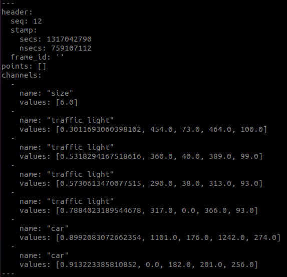
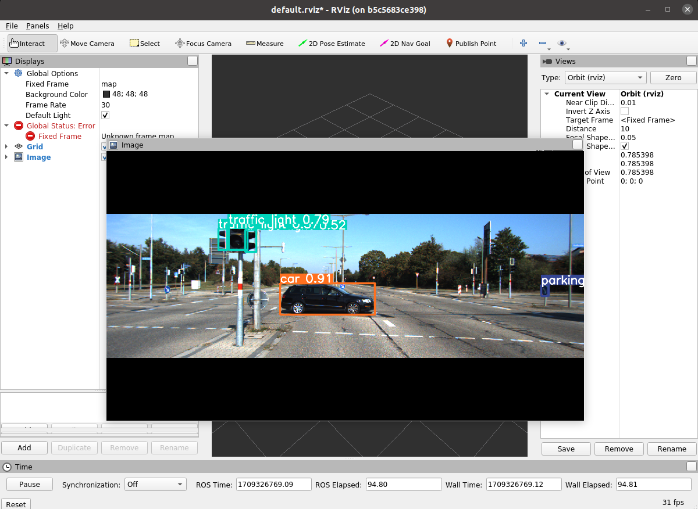

# YOLOv9
### Install Eufs_Sim
Install requirements
```
sudo apt update
sudo apt-get install ros-noetic-ackermann-msgs ros-noetic-twist-mux ros-noetic-joy ros-noetic-controller-manager ros-noetic-velodyne-simulator ros-noetic-effort-controllers ros-noetic-velocity-controllers ros-noetic-joint-state-controller ros-noetic-gazebo-ros-control ros-noetic-hector-gazebo-plugins
```
Clone Library
```
cd catkin_ws/src
git clone https://github.com/eufsa/eufs_sim
cd .. 
catkin_make
```

Change python to python3 in executable files
```
gedit src/eufs_sim/robot_control/nodes/twist_to_ackermannDrive.py
```
Run
```
roslaunch eufs_gazebo small_track.launch
```
Publish Joint States
```
roslaunch robot_control rqt_robot_control.launch
```

### Build Yolo
```
cd (your_ros_ws)/src
git clone https://github.com/UdayVerma20/YoloV9.git
cd ..
catkin_make
cd (your_ros_ws)/src/YoloV9/yolov9_ros1
pip install -r requirements.txt
pip uninstall opencv-python-headless
```
### Download weights
https://drive.google.com/file/d/1vX-n-9EOz5cMVYtYl_za2PolRBuvcg3g/view?usp=sharing 
Install in directory yolov9_ros1/ros

### Modify Config
* modify `ros/config/config.yaml`  
* modify variable `yolo_path` in `ros/scripts/detect_ros.py`(top of code)  
* modify config file path in `ros/launch/detect.launch`

### Test Weights
```
cd (your_ros_ws)/src/YoloV9/yolov9_ros1
python detect.py --weights weights.pt --source 0 -- conf 0.5 --device 0
```
--weights (relative path to weights) --source (image path or 0 for webcam) -- conf (detection confidence score threshold) --device ( cpu for windows, 0 for gpu { check torch.cuda.is_available() for gpu access})

### Run
```
chmod +x (your_ros_ws/src/YoloV9/yolov9_ros1/ros/scripts/detect_ros.py)
roslaunch yolov9_ros1 detect.launch
```  

### Result
**Publish**:  
* sensor_msgs/PointCloud
  ```
  header->stamp : same as image time
  channels->name
    L size
    L object_1's name
    L object_2's name
    :
    :
  channels->vallues
    L number of object
    L object_1's [conf,x1,y1,x2,y2]
    L object_2's [conf,x1,y1,x2,y2]
    :
    :
  ```
  <div align="center">
    <a href="./">
        
    </a>
  </div>

* senor_msgs/Image (Optional) -> modify `config.yaml`

<div align="center">
    <a href="./">
        
    </a>
</div>
