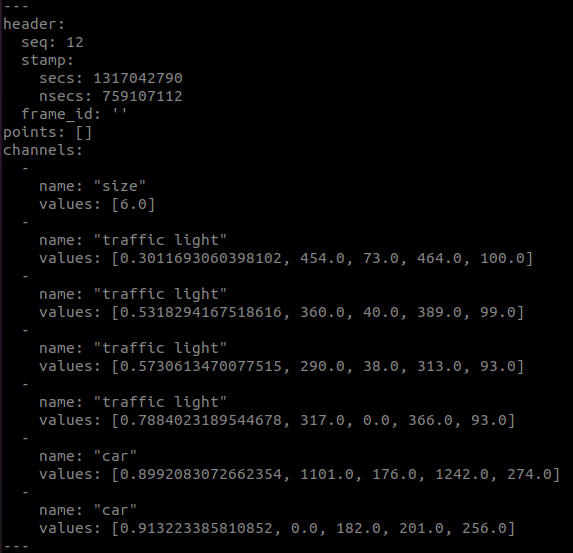
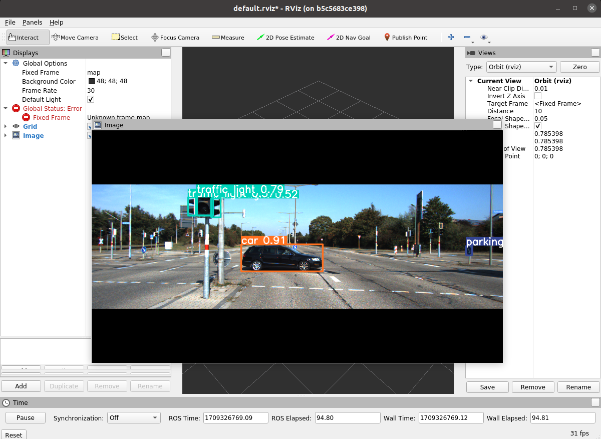

# YOLOv9
 
### Build
```
$ cd (your_ros_ws)/src
$ git clone https://github.com/UdayVerma/YoloV9.git
$ cd ..
$ catkin_make
$ cd (your_ros_ws)/src/YoloV9/yolov9_ros
$ pip install -r requirements.txt
$ pip uninstall opencv-python-headless
```

### Modify Config
* modify `ros/config/config.yaml`  
* modify variable `yolo_path` in `ros/scripts/detect_ros.py`(top of code)  
* modify config file path in `ros/launch/detect.launch`

### Run
```
$ chmod +x (your_ros_ws/src/YoloV9/yolov9_ros/ros/scripts/detect_ros.py)
$ roslaunch yolov9_ros detect.launch
```  

### Result
**Publish**:  
* sensor_msgs/PointCloud
  ```
  header->stamp : same as image time
  channels->name
    L size
    L object_1's name
    L object_2's name
    :
    :
  channels->vallues
    L number of object
    L object_1's [conf,x1,y1,x2,y2]
    L object_2's [conf,x1,y1,x2,y2]
    :
    :
  ```
  <div align="center">
    <a href="./">
        
    </a>
  </div>

* senor_msgs/Image (Optional) -> modify `config.yaml`

<div align="center">
    <a href="./">
        
    </a>
</div>
